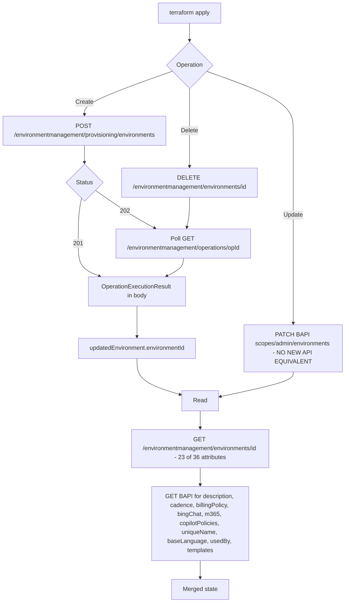

<!-- markdownlint-disable-file -->
# Task Research: Migrate Environment Resource and Related Data Sources from BAPI to Power Platform API

Research to migrate `powerplatform_environment` (resource) and the `powerplatform_environments`, `powerplatform_locations`, `powerplatform_languages`, `powerplatform_currencies` data sources from the legacy BAPI (`api.bap.microsoft.com`) endpoints to the public Power Platform API (`api.powerplatform.com`) Environment Management surface documented at https://learn.microsoft.com/en-us/rest/api/power-platform/environmentmanagement/environment-provisioning.

## Task Implementation Requests

* Use the Power Platform API (Environment Management / Environment Provisioning) in `powerplatform_environment` resource instead of the current BAPI API.
* Replace BAPI usage in `powerplatform_locations`, `powerplatform_languages`, `powerplatform_currencies`, and `powerplatform_environments` data sources with the Power Platform API.
* Move environment provisioning (create/lifecycle) to the Power Platform API.
* Analyze attribute-level impact for each resource/data source and produce a mapping table: attributes that migrate, attributes missing in the new API, and new properties the new API exposes that are not currently surfaced (e.g. `macroRegion`).

## Scope and Success Criteria

* Scope: `internal/services/environment` (resource + data source + client + DTOs), `internal/services/locations`, `internal/services/languages`, `internal/services/currencies`. Out of scope: `powerplatform_environment_settings`, `powerplatform_managed_environment`, `powerplatform_environment_group_rule_set`, backup/restore/failover endpoints, `internal/services/environment_templates` (noted as adjacent).
* Assumptions:
  * Target `api-version=2024-10-01` for all `environmentmanagement` operations (the only Stable version).
  * Auth uses the existing `https://api.powerplatform.com/.default` scope — already wired in `internal/constants/constants.go` and resolved automatically by `tryGetScopeFromURL` in `internal/api/client.go:253-270`.
  * Breaking schema changes require a `breaking` Changie entry and a major-version release.
* Success Criteria:
  * A complete attribute-by-attribute mapping exists for all five surfaces (migrates / missing / new).
  * A recommended migration approach is selected with rationale, including how to handle the blocking gaps.
  * Every claim is traceable to a Learn URL or a `path/file.go:LINE` reference.

## Outline

1. Executive impact summary (three blocking findings).
2. Endpoint mapping — BAPI to Power Platform API.
3. Attribute mapping tables (the requested deliverable):
   * 3.1 `powerplatform_environment` resource
   * 3.2 `powerplatform_environments` data source
   * 3.3 `powerplatform_locations`
   * 3.4 `powerplatform_languages`
   * 3.5 `powerplatform_currencies`
4. New properties available to expose (including `macroRegion`).
5. Technical scenarios and selected approach.
6. Unverified items that block implementation.

## Potential Next Research

* mitmproxy capture of `POST /environmentmanagement/provisioning/environments` to resolve the 202 header shape (`Location` vs `Operation-Location`) and `Retry-After`.
  * Reasoning: `internal/api/lifecycle.go:53-70` reads both headers, but the polling URL/response body shape must be known to write httpmock responders.
  * Reference: devdocs/adr/mitmproxy.md, devdocs/adr/httpmocks.md
* Live capture of `GET /environmentmanagement/environments` to pin the enum values for `state`, `adminMode`, `backgroundOperationsState`, `protectionLevel`, `clusterCategory` — all published as bare `string`.
  * Reasoning: `dataverse.administration_mode_enabled` and `release_cycle` are derived from string comparisons today; validators and plan modifiers depend on exact values.
  * Reference: .copilot-tracking/research/subagents/2026-08-18/powerplatform-api-environmentmanagement.md section 4.3
* Confirm whether an "Update Environment" operation is on the published Power Platform release plan.
  * Reasoning: this single gap determines whether the migration can ever be wholesale.
  * Reference: https://learn.microsoft.com/en-us/power-platform/admin/programmability-whats-new-changed
* Determine the required Entra granular permission or admin role for provisioning-side writes.
  * Reasoning: only `EnvironmentManagement.Environments.Read` is published; no `.Create`/`.Delete`. Service-principal auth for the provider may break.
  * Reference: https://learn.microsoft.com/en-us/power-platform/admin/programmability-permission-reference
* Verify sovereign cloud (GCC / GCC High / DoD / China) coverage of `environmentmanagement` against the cloud tables in `internal/constants/constants.go`.
  * Reasoning: `release_cycle` derivation already branches on `FirstReleaseClusterName` per cloud (`internal/config/config.go:79-104`).
* Confirm whether managed-environment `extendedSettings` are reachable via the `governance` namespace.
  * Reasoning: the new API exposes only a flat `protectionLevel`; `powerplatform_managed_environment` depends on 14+ `extendedSettings` keys.

## Research Executed

### File Analysis

* internal/services/environment/resource_environment.go (899 lines)
  * Schema at :63-377 — 18 top-level attributes, 5 `enterprise_policies` nested, 15 `dataverse` nested.
  * `Update` at :571-682 — 14-step sequence, including a deliberate double-PATCH rename workaround at :635-643.
  * Imperative validation: location/region :429, language :443, currency :449, generative AI :435 and :582.
* internal/services/environment/api_environment.go (757 lines)
  * All 18 HTTP calls. BAPI list/get at :681-699 and :246-275; create at :460-539; update at :610-679 (pinned to `api-version=2021-04-01` per the comment at :625-627); `provisionInstance` at :350-413; delete at :281-348.
  * `GetEnvironmentHostById` at :229-244 depends on `properties.linkedEnvironmentMetadata.instanceUrl`.
* internal/services/environment/dto.go (314 lines)
  * `EnvironmentDto` / `EnviromentPropertiesDto` / `LinkedEnvironmentMetadataDto` / `LocationArrayDto`.
  * `EnvironmentTypes` at :30 allows only 5 SKUs; `CadenceTypes` :33; `ReleaseCycleTypes` :34.
  * Latent bug: read JSON tag is `template` (singular, :156) but write tag is `templates` (plural, :230).
* internal/services/environment/models.go (~430 lines)
  * `convertSourceModelFromEnvironmentDto`; `attrTypesDataverseObject` at :222-238; enterprise policy conversion at :379-430 overwrites rather than appends.
* internal/services/environment/datasource_environments.go
  * Schema :48-232, `Read` :243-299. No filter parameters. 1 + 3N HTTP calls for N environments (:278-284).
* internal/services/locations/datasource_locations.go:49-104, internal/services/locations/api_locations.go:26-42
* internal/services/languages/datasource_languages.go:44-90, internal/services/languages/api_languages.go:28-55
* internal/services/currencies/datasource_currencies.go:49-95, internal/services/currencies/api_currencies.go:27-52
* internal/api/lifecycle.go:53-103 — `DoWaitForLifecycleOperationStatus`; reads `Location` then falls back to `Operation-Location`; terminal states `Succeeded`/`Failed`; `404` treated as success.
* internal/mocks/mocks.go:47,69-82 — global responders for the three BAPI reference endpoints plus a fail-fast `RegisterNoResponder`. Changing those URLs breaks every environment unit test.
* internal/constants/constants.go — `PUBLIC_POWERPLATFORM_API_DOMAIN`, `PUBLIC_POWERPLATFORM_API_SCOPE` already present; `BAP_API_VERSION = "2023-06-01"` at :188/:194.

### Code Search Results

* `NewEnvironmentClient` / `GetEnvironment(` / `GetEnvironmentHostById`
  * 12 downstream services construct `environment.Client`: application, authorization, connection, copilot_studio_application_insights, data_record, disaster_recovery, enterprise_policy, environment_wave, managed_environment, powerapps, publisher, solution_checker_rules.
* `providers/Microsoft.BusinessAppPlatform`
  * Also hard-coded outside `environment.Client`: internal/services/solution/api_solution.go:400-401 and internal/services/environment_groups/api_environment_group.go:132-137.
* `api.powerplatform.com` usage already in the repo
  * licensing (`/licensing/*`, `2022-03-01-preview`), capacity, role_based_access (`/authorization/*`, **`2024-10-01`** — closest precedent), application (`/appmanagement/*`), environment_groups (`/environmentmanagement/environmentGroups/...` with `api-version=1` on a tenant-sharded host — inconsistent with the documented flat `2024-10-01` form), environment_group_rule_set (`/governance/*`), connection, managed_solution.

### External Research

* Microsoft Learn — https://learn.microsoft.com/en-us/rest/api/power-platform/environmentmanagement/environment-provisioning and all child operation pages (provision-new-environment, link-dataverse, get-supported-locations, get-provisioning-currencies, get-provisioning-languages, get-provisioning-templates).
* Microsoft Learn — environments (list/get), environment-delete, environment-recover, environment-reset, environment-copy, environment-managed-governance, operation (3 pages), environment-management-settings, environment-groups.
* Microsoft Learn — https://learn.microsoft.com/en-us/power-platform/admin/programmability-versioning-support (`2024-10-01` is the single Stable version; `2020-10-01` is the legacy BAP surface).
* Microsoft Learn — https://learn.microsoft.com/en-us/power-platform/admin/programmability-permission-reference (no `EnvironmentManagement.Environments.Create`/`.Delete` published).
* Microsoft Learn — https://learn.microsoft.com/en-us/power-platform/admin/programmability-whats-new-changed (provisioning endpoints shipped **April 2026**; `Reset Environment` July 2026 with "various bug fixes to Provision New Environment").
* Full detail: .copilot-tracking/research/subagents/2026-08-18/powerplatform-api-environmentmanagement.md

### Project Conventions

* Standards referenced: .github/copilot-instructions.md — service layout (`api_*.go`, `dto.go`, `models.go`, `resource_*.go`, `datasource_*.go`), `Dto` suffix, `convertDtoToModel`/`convertModelToDto`, `MarkdownDescription` only, `helpers.EnterRequestContext`, `tflog` logging, `TestUnit`/`TestAcc` prefixes, JSON fixtures under `tests/{resource,datasource}/<scenario>/<method>_<object>.json`, one Changie entry per PR.
* Instructions followed: docs under `/docs` are generated — update `MarkdownDescription` and run `make userdocs`.

## Key Discoveries

### Discovery 1 — There is no Update Environment endpoint (blocking)

There is no `PATCH /environmentmanagement/environments/{environmentId}` and no "Update Environment" operation anywhere in the `environmentmanagement` namespace. Confirmed three ways: the complete Dec 2024 to Jul 2026 what's-new endpoint list contains no such entry; the `Environments` operation group lists only `Get Environment By Id For User` and `List Environments For User`; there is no `Environment-Update` operation group.

The provider updates 16 attributes in place today via `PATCH https://api.bap.microsoft.com/providers/Microsoft.BusinessAppPlatform/scopes/admin/environments/{id}?api-version=2021-04-01` (internal/services/environment/api_environment.go:610-679).

Partial workarounds on the new API:

| Today's in-place update | New API replacement |
| --- | --- |
| `environment_group_id` | `POST /environmentmanagement/environmentGroups/{groupId}/addEnvironment/{environmentId}` (+ remove) |
| `protection_level` (managed env) | `POST .../governanceSetting/enableManaged` / `disableManaged` |
| `billing_policy_id` | `POST /licensing/billingPolicies/{id}/environments/add` and `/remove` — already used at internal/services/licensing/api_licensing.go:167-219 |
| `display_name`, `description`, `domain`, `security_group_id`, `language_code`, `currency_code`, `templates` | only via the **destructive** `POST .../reset`, which wipes the Dataverse database — not acceptable as a Terraform in-place update |
| `environment_type` (SKU) | no equivalent to `modifySku` |
| `cadence`, `allow_bing_search`, `allow_microsoft_365_services`, `allow_moving_data_across_regions`, `allow_flex_routing` | no equivalent |

### Discovery 2 — The read model is flat and drops ~20 properties

`EnvironmentResponse` has **no `properties` wrapper and no `linkedEnvironmentMetadata` sub-object**. Dataverse fields (`url`, `domainName`, `version`, `dataverseId`, `securityGroupId`) are promoted to the top level. Every JSON path in `internal/services/environment/dto.go` changes.

Complete new read model: `id`, `displayName`, `type`, `state`, `tenantId`, `geo`, `azureRegion`, `clusterCategory`, `adminMode`, `backgroundOperationsState`, `protectionLevel`, `environmentGroupId`, `connectedGroupId`, `securityGroupId`, `scenarioName`, `dataverseId`, `url`, `domainName`, `version`, `createdDateTime`, `createdBy{id,type}`, `createdFor{id,type}`, `deletedDateTime`, `retentionDetails{retentionPeriod,availableFromDateTime}`, `finOpsMetadata{id,type,url}`, `enterprisePolicies{encryption,identity,networkInjection,privateEndpoint}` each `{id,resourceId,status,error}`.

Critically, **`url` survives** — so `GetEnvironmentHostById` (internal/services/environment/api_environment.go:229-244), a hard dependency of 6+ other services, keeps working.

### Discovery 3 — Managed-environment `extendedSettings` have no new-API surface

BAPI exposes `properties.governanceConfiguration.settings.extendedSettings` with 14+ keys (`limitSharingMode`, `maxLimitUserSharing`, `solutionCheckerMode`, `suppressValidationEmails`, `solutionCheckerRuleOverrides`, `isGroupSharingDisabled`, `excludeEnvironmentFromAnalysis`, `includeOnHomepageInsights`, `disableAiGeneratedDescriptions`, the `solutionCloudFlows-*` and `bot-*` keys). The new API exposes only a flat `protectionLevel` string plus enable/disable toggles. `powerplatform_managed_environment` depends on the full set.

### Discovery 4 — The provisioning surface is four months old

Provision New Environment, Link Dataverse, Get Supported Locations, Get Provisioning Currencies, Get Provisioning Languages, Get Provisioning Templates all shipped **April 2026**. July 2026 shipped "various bug fixes to Provision New Environment". No Learn page for the namespace publishes an example request or response payload — every JSON sample in the subagent research is reconstructed from schema tables.

### Discovery 5 — Genuine wins in the new API

* `ValidateOnly` + `ValidateProperties` query parameters on every write operation, replacing BAPI `validateDelete` and `validateEnvironmentDetails`.
* `errorDetail.fieldErrors.{field}.suggestedValue` — the server proposes a valid alternative (for example an available domain name), removing a round-trip.
* `stageStatuses[]` per-stage operation progress, versus BAPI's single `provisioningState`.
* OData query support on list: `ids`, `$filter` (on `dataverseId`, `type`, `geo`, `state`, `environmentGroupId`, `domainName`), `$select`, `$top`, `$skip`, `$orderby`, `@odata.nextlink`.
* A single global polling host — no `https://{geo}.api.bap.microsoft.com` geo-routing.
* `EnvironmentSku` documents 12 values versus the 5 the provider allows (internal/services/environment/dto.go:30).

### Discovery 6 — Three unmapped attributes are recoverable from sibling endpoints, not from a second GET

The `EnvironmentResponse` model was re-verified against three independent code-generated renderings of the same OpenAPI spec — the Learn `Definitions` section, the Kiota-generated `Microsoft.PowerPlatform.Management.Models.EnvironmentResponse` C# class, and the "Power Platform for Admins V2" connector reference. All three agree on the same 26 properties with **zero differences**, so a follow-up `GET /environmentmanagement/environments/{id}` cannot recover anything the model omits. `OperationExecutionResult` has no request-echo field either, and there is no `$expand` on either read operation.

Three attributes are nonetheless recoverable from sibling endpoints:

| Attribute | Recovery path | Cost |
| --- | --- | --- |
| `billing_policy_id` | `GET /licensing/environments/{environmentId}/billingPolicy?api-version=2024-10-01` → `.id` | One new call per environment |
| `dataverse.language_code` | Dataverse Web API `organizations.languagecode` | Free — already queried for `currency_code` at internal/services/environment/api_environment.go:701-720 |
| `dataverse.unique_name` | Dataverse Web API `organizations.uniquename` | Free — same query |

This cuts the environment resource from 19 breaking attributes to 13. Eight remain genuinely unrecoverable without BAPI: `description`, `cadence`, `dataverse.templates`, `dataverse.template_metadata`, and the four `allow_*` flags. Full analysis: .copilot-tracking/research/subagents/2026-08-18/get-environment-response-completeness.md

## Endpoint Mapping

| Purpose | BAPI (today) | Power Platform API (`api-version=2024-10-01`) | Status |
| --- | --- | --- | --- |
| List environments | `GET .../scopes/admin/environments?$expand=properties/billingPolicy,properties/copilotPolicies` | `GET /environmentmanagement/environments` | Available, flat shape, adds OData filtering |
| Get environment | `GET .../scopes/admin/environments/{id}?$expand=permissions,properties.capacity,...` | `GET /environmentmanagement/environments/{id}` | Available, `$select` only |
| Create environment | `POST .../environments` | `POST /environmentmanagement/provisioning/environments` | Available |
| **Update environment** | `PATCH .../scopes/admin/environments/{id}` | **none** | **BLOCKING GAP** |
| Modify SKU | `POST .../scopes/admin/environments/{id}/modifySku` | **none** | **BLOCKING GAP** |
| Delete environment | `DELETE .../scopes/admin/environments/{id}` | `DELETE /environmentmanagement/environments/{id}` | Available |
| Validate delete | `POST .../environments/{id}/validateDelete` (not implemented today) | `DELETE .../environments/{id}?ValidateOnly=true` | Available, better pattern |
| Add Dataverse DB | `POST .../environments/{id}/provisionInstance` | `PATCH /environmentmanagement/provisioning/environments/{id}/link` | Available |
| Validate name/domain | `POST .../validateEnvironmentDetails` | `fieldErrors[].suggestedValue` on 400; `ValidateOnly` on provision UNVERIFIED | Partial |
| Poll lifecycle op | `GET https://{geo}.api.bap.microsoft.com/.../lifecycleOperations/{id}` | `GET /environmentmanagement/operations/{opId}` or `GET /environmentmanagement/environments/{envId}/operations/{opId}` | Available |
| Recover soft-deleted | not implemented | `POST /environmentmanagement/environments/{id}/recover` | New capability |
| Reset environment | not implemented | `POST /environmentmanagement/environments/{id}/reset` | New capability |
| Copy environment | not implemented | `POST /environmentmanagement/environments/{targetId}/copy` | New capability |
| List locations | `GET .../locations` | `GET /environmentmanagement/provisioning/locations` | Available, property gaps |
| List currencies | `GET .../locations/{loc}/environmentCurrencies` | `GET /environmentmanagement/provisioning/locations/{loc}/currencies` | Available, fewer properties |
| List languages | `GET .../locations/{loc}/environmentLanguages` | `GET /environmentmanagement/provisioning/locations/{loc}/languages` | Available, fewer properties |
| List templates | `GET .../locations/{loc}/environmentTemplates` | `GET /environmentmanagement/provisioning/locations/{loc}/templates` | Available, richer (per-SKU availability) |
| Admin mode on/off | `PATCH` `properties.states.runtime.id` | `environment-state/enable-environment` / `disable-environment` | **Paths UNVERIFIED — Learn pages 404** |

## Attribute Mapping Tables

Legend:

* **OK** — direct equivalent exists on the new API read model; only the JSON path changes.
* **WRITE-ONLY** — the field exists in the create/link request but is **not returned** by GET, so Terraform cannot detect drift or support import for it.
* **MISSING** — no equivalent anywhere in the new API.
* **RENAMED** — equivalent exists under a different name or shape; value semantics need confirmation.
* **NEW** — property exists only on the Power Platform API and is not currently exposed by the provider.

### 3.0 Consolidated attribute impact summary

Every attribute of every in-scope surface, grouped by status. Detailed per-surface tables with BAPI source paths follow in 3.1 through 3.5.

A standalone copy of these tables, extended with a **Migration Result** column that classifies each attribute's practitioner impact (None / Behavior / Verify / Avoidable / Breaking: replace | null | removed | value / Additive), lives at .copilot-tracking/research/2026-08-18/powerplatform-api-attribute-impact-tables.md. That document is the authoritative source for breaking-change classification.

#### `powerplatform_environment` (resource) — 36 existing attributes

| Status | Terraform attribute | Power Platform API path | Note |
| --- | --- | --- | --- |
| OK | `id` | `id` | Same GUID; ARM-style `id` disappears. |
| OK | `location` | `geo` | Renamed; verify `unitedstates`/`europe` values still match. |
| OK | `azure_region` | `azureRegion` | Value survives; client-side validation source does not. |
| OK | `environment_type` | `type` | New API documents 12 SKUs vs the 5 allowed today. |
| OK | `display_name` | `displayName` | Readable, but no longer updatable in place. |
| OK | `release_cycle` | `clusterCategory` (read), `cluster.category` (create) | Already `RequiresReplace`, so no update loss. |
| OK | `environment_group_id` | `environmentGroupId` (read), `parentEnvironmentGroup.id` (create) | Update via `environmentGroups/{g}/addEnvironment/{e}`. |
| OK | `enterprise_policies[].type` | synthesized | Gains a fourth value, `PrivateEndpoint`. |
| OK | `enterprise_policies[].id` | `enterprisePolicies.*.id` | |
| OK | `enterprise_policies[].status` | `enterprisePolicies.*.status` | Was `linkStatus`; enum now published (6 values). |
| OK | `dataverse.url` | `url` | Critical — `GetEnvironmentHostById` plus 6+ services. |
| OK | `dataverse.domain` | `domainName` | Update lost. |
| OK | `dataverse.organization_id` | `dataverseId` | |
| OK | `dataverse.version` | `version` | |
| OK | `dataverse.security_group_id` | `securityGroupId` (top level) | Update lost. |
| OK | `dataverse.currency_code` | unchanged (Dataverse WebAPI) | Read already bypasses BAPI. |
| OK | `dataverse.background_operation_enabled` | `backgroundOperationsState` | Update lost. |
| OK | `dataverse.administration_mode_enabled` | `adminMode` | Enum UNVERIFIED; update needs the 404'd `environment-state` endpoints. |
| OK | `timeouts` | n/a | Framework-only. |
| RENAMED | `enterprise_policies[].system_id` | `enterprisePolicies.*.resourceId` | Semantics differ — `resourceId` is a full Azure resource ID. |
| RENAMED | `dataverse.linked_app_type` | `finOpsMetadata.type` | Value equivalence UNVERIFIED. |
| RENAMED | `dataverse.linked_app_id` | `finOpsMetadata.id` | Value equivalence UNVERIFIED. |
| RENAMED | `dataverse.linked_app_url` | `finOpsMetadata.url` | Value equivalence UNVERIFIED. |
| WRITE-ONLY | `description` | `description` (create request) | Not returned by GET → drift undetectable, update impossible. |
| WRITE-ONLY | `owner_id` | `usedBy.userId` (create request) | Already `RequiresReplace`; import and drift break. |
| WRITE-ONLY | `billing_policy_id` | `billingPolicy.id` (create request) | Read must stay on BAPI or move to `licensing/billingPolicies/{id}/environments`. |
| WRITE-ONLY | `dataverse.language_code` | `linkedEnvironmentMetadata.baseLanguageCode` (create/link) | Already `RequiresReplace`; import and drift break. |
| WRITE-ONLY | `dataverse.templates` | `templates` (create/link) | Already stitched from plan today, so no practical change. |
| WRITE-ONLY | `dataverse.template_metadata` | `templateMetadata` (create/link, bare `object`) | `PostProvisioningPackages` shape UNVERIFIED. |
| MISSING | `cadence` | — | No read and no create field. Frequent/Moderate cadence unreachable. |
| MISSING | `allow_bing_search` | — | Not on `/environments/{id}/settings` either. |
| MISSING | `allow_microsoft_365_services` | — | Same. |
| MISSING | `allow_moving_data_across_regions` | — | Same. |
| MISSING | `allow_flex_routing` | — | Same. |
| MISSING | `enterprise_policies[].location` | — | Breaking removal. |
| MISSING | `dataverse.unique_name` | — | Breaking removal. |

New attributes available to add:

| Status | Proposed attribute | Power Platform API path | Kind |
| --- | --- | --- | --- |
| NEW | `macro_region` | `macroRegion` (create request) | Optional + RequiresReplace; mutually exclusive with `location`; not read back. |
| NEW | `connected_group_id_for_teams_environment` | create request | Optional + RequiresReplace. |
| NEW | `currency_name`, `currency_symbol`, `currency_precision` | `linkedEnvironmentMetadata.currency.{name,symbol,precision}` | Optional; BAPI create accepted only `code`. |
| NEW | `state` | `state` | Computed; enum UNVERIFIED. |
| NEW | `tenant_id` | `tenantId` | Computed; in BAPI but never surfaced. |
| NEW | `connected_group_id` | `connectedGroupId` | Computed. |
| NEW | `scenario_name` | `scenarioName` | Computed. |
| NEW | `protection_level` | `protectionLevel` | Computed. |
| NEW | `created_date_time` | `createdDateTime` | Computed. |
| NEW | `created_by` (`id`, `type`) | `createdBy` | Computed. |
| NEW | `created_for` (`id`, `type`) | `createdFor` | Computed; **no BAPI equivalent**. |
| NEW | `deleted_date_time` | `deletedDateTime` | Computed; **no BAPI equivalent**. |
| NEW | `retention_details` (`retention_period`, `available_from_date_time`) | `retentionDetails` | Computed. |
| NEW | `enterprise_policies[].type = "PrivateEndpoint"` | `enterprisePolicies.privateEndpoint` | Computed; **no BAPI equivalent**. |
| NEW | `enterprise_policies[].error` | `enterprisePolicies.*.error` | Computed; **no BAPI equivalent**. |

#### `powerplatform_environments` (data source) — 40 existing attributes

Element shape is the identical `SourceModel`, so every `environments[*].<attribute>` row above applies unchanged. Data-source-only rows:

| Status | Terraform attribute | Power Platform API path | Note |
| --- | --- | --- | --- |
| OK | `environments` | `value[]` | Envelope unchanged (`value` + `@odata.nextlink`). |
| OK | `environments[*].timeouts` | n/a | Vestigial — present only because `SourceModel` carries `Timeouts`. |
| OK | `timeouts` | n/a | Read-only timeouts. |
| NEW | `ids` | `ids` query param | Optional filter input. |
| NEW | `filter` | `$filter` on `dataverseId`, `type`, `geo`, `state`, `environmentGroupId`, `domainName` | Optional filter input. |
| NEW | `top` / `skip` / `orderby` | `$top` / `$skip` / `$orderby` | Optional paging inputs; `@odata.nextlink` must be followed. |

#### `powerplatform_locations` — 10 existing attributes

| Status | Terraform attribute | Power Platform API path | Note |
| --- | --- | --- | --- |
| OK | `locations[].name` | `collection[].name` | |
| OK | `locations[].display_name` | `collection[].displayName` | |
| OK | `locations[].code` | `collection[].code` | Value may change (`"NA"` vs `"NAM"`) — UNVERIFIED. |
| OK | `locations[].is_default` | `collection[].isDefault` | |
| OK | `locations[].is_disabled` | `collection[].isDisabled` | |
| OK | `locations[].can_provision_database` | `collection[].canProvisionDatabase` | |
| OK | `timeouts` | n/a | |
| MISSING | `locations[].id` | — | ARM path; synthesizable but the value changes. |
| MISSING | `locations[].can_provision_customer_engagement_database` | — | Breaking removal. |
| MISSING | `locations[].azure_regions` | — | Breaking removal **and** kills `powerplatform_environment.azure_region` validation. |
| NEW | `locations[].has_first_release_island_available_for_provisioning` | `collection[].hasFirstReleaseIslandAvailableForProvisioning` | Directly relevant to `release_cycle = "Early"`. |
| NEW | `location_selection_mode` | `locationSelectionMode` | `Region` or `MacroRegion`. |
| NEW | `macro_regions[].macro_region_id` | `macroRegions[].macroRegionId` | |
| NEW | `macro_regions[].display_name` | `macroRegions[].displayName` | |
| NEW | `macro_regions[].data_residency_note` | `macroRegions[].dataResidencyNote` | |

#### `powerplatform_languages` — 8 existing attributes

| Status | Terraform attribute | Power Platform API path | Note |
| --- | --- | --- | --- |
| OK | `location` (input) | `{location}` path segment | |
| OK | `languages[].localized_name` | `collection[].localizedName` | |
| OK | `languages[].locale_id` | `collection[].localeId` | |
| OK | `languages[].is_tenant_default` | `collection[].isTenantDefault` | |
| OK | `timeouts` | n/a | |
| MISSING | `languages[].id` | — | ARM path; synthesizable but the value changes. |
| MISSING | `languages[].name` | — | Derivable as `string(localeId)`. `environment.languageCodeValidator` matches on this. |
| MISSING | `languages[].display_name` | — | Only `localizedName` survives. Breaking removal. |

No new properties — the new language object is strictly smaller.

#### `powerplatform_currencies` — 8 existing attributes

| Status | Terraform attribute | Power Platform API path | Note |
| --- | --- | --- | --- |
| OK | `location` (input) | `{location}` path segment | |
| OK | `currencies[].code` | `collection[].code` | |
| OK | `currencies[].symbol` | `collection[].symbol` | |
| OK | `currencies[].is_tenant_default` | `collection[].isTenantDefault` | |
| OK | `timeouts` | n/a | |
| MISSING | `currencies[].id` | — | ARM path; synthesizable but the value changes. |
| MISSING | `currencies[].name` | — | Equal to `code` in practice. `environment.currencyCodeValidator` matches on this. |
| MISSING | `currencies[].type` | — | ARM type discriminator; no longer meaningful. |

No new properties on the list endpoint. `name`, `symbol`, and `precision` exist only on the create-request currency model.

#### Totals

| Surface | Attributes | OK | RENAMED | WRITE-ONLY | MISSING | NEW available |
| --- | --- | --- | --- | --- | --- | --- |
| `powerplatform_environment` | 36 | 19 | 4 | 6 | 7 | 15 |
| `powerplatform_environments` | 40 | 22 | 4 | 6 | 7 | 6 (filters/paging) |
| `powerplatform_locations` | 10 | 7 | 0 | 0 | 3 | 5 |
| `powerplatform_languages` | 8 | 5 | 0 | 0 | 3 | 0 |
| `powerplatform_currencies` | 8 | 5 | 0 | 0 | 3 | 0 |

The same attributes classified by practitioner impact under a **full** migration, after crediting the verified recovery paths (see the tables document for per-attribute detail):

| Surface | None | Behavior | Verify | Avoidable | Breaking | of which replace / null / removed / value |
| --- | --- | --- | --- | --- | --- | --- |
| `powerplatform_environment` | 14 | 1 | 7 | 1 | **13** | 6 / 2 / 5 / 0 |
| `powerplatform_environments` | 23 | 1 | 7 | 1 | **8** | 0 / 3 / 5 / 0 |
| `powerplatform_locations` | 6 | 0 | 1 | 0 | **3** | 0 / 0 / 3 / 0 |
| `powerplatform_languages` | 5 | 0 | 0 | 1 | **2** | 0 / 0 / 2 / 0 |
| `powerplatform_currencies` | 5 | 0 | 0 | 2 | **1** | 0 / 0 / 1 / 0 |

Under the recommended staged hybrid, Stages 1 and 2 introduce **none** of the `replace` or `null` outcomes; those land only when the read and update paths move in Stage 3. Keeping `Update` on BAPI eliminates all 6 `replace` outcomes, and retaining one supplemental BAPI GET eliminates the remaining 2 `null` and 5 `removed` outcomes.

### 3.1 `powerplatform_environment` resource

Schema: internal/services/environment/resource_environment.go:63-377

| # | Terraform attribute | BAPI JSON path (today) | Power Platform API path | Status | Impact / notes |
| --- | --- | --- | --- | --- | --- |
| 1 | `id` | `name` | `id` | **OK** | Same GUID; the ARM-style `id` disappears entirely. |
| 2 | `location` | `location` | `geo` | **OK** (renamed) | Verify `Location.name` values still match (`unitedstates`, `europe`). |
| 3 | `azure_region` | `properties.azureRegion` | `azureRegion` | **OK** | But the *validation* source disappears — see locations table row `azure_regions`. |
| 4 | `environment_type` | `properties.environmentSku` | `type` | **OK** (renamed) | New API documents 12 SKUs; provider allows 5 (dto.go:30). Opportunity to widen. |
| 5 | `display_name` | `properties.displayName` | `displayName` | **OK** | Update path lost (no PATCH). |
| 6 | `description` | `properties.description` | — (create request has `description`) | **WRITE-ONLY** | Cannot read back, so drift is undetectable and update is impossible. |
| 7 | `cadence` | `properties.updateCadence.id` | — | **MISSING** | Not in the create request either. Frequent/Moderate release cadence is unreachable. |
| 8 | `release_cycle` | `properties.cluster.category` | `clusterCategory` (read), `cluster.category` (create) | **OK** | Already `RequiresReplace`, so the missing PATCH is harmless. |
| 9 | `owner_id` | `properties.usedBy.id` | — (create request has `usedBy.userId`) | **WRITE-ONLY** | Already `RequiresReplace`, but drift and import break. |
| 10 | `environment_group_id` | `properties.parentEnvironmentGroup.id` | `environmentGroupId` (read), `parentEnvironmentGroup.id` (create) | **OK** | Update via `environmentGroups/{g}/addEnvironment/{e}`. |
| 11 | `billing_policy_id` | `properties.billingPolicy.id` (`$expand`) | — (create request has `billingPolicy.id`) | **WRITE-ONLY** | Read must stay on BAPI or move to `licensing/billingPolicies/{id}/environments`. |
| 12 | `allow_bing_search` | `properties.bingChatEnabled` | — | **MISSING** | Not covered by `/environmentmanagement/environments/{id}/settings` either (that surface is Copilot Studio / Power Pages / Power Apps AI toggles). |
| 13 | `allow_microsoft_365_services` | `properties.m365Enabled` | — | **MISSING** | Same. |
| 14 | `allow_moving_data_across_regions` | `properties.copilotPolicies.crossGeoCopilotDataMovementEnabled` | — | **MISSING** | Same. |
| 15 | `allow_flex_routing` | `properties.copilotPolicies.crossBoundaryCopilotDataMovementEnabled` | — | **MISSING** | Same. |
| 16 | `enterprise_policies[].type` | synthesized (`Identity`/`NetworkInjection`/`Encryption`) | synthesized (plus `PrivateEndpoint`) | **OK** | New API adds a fourth slot. |
| 17 | `enterprise_policies[].id` | `properties.enterprisePolicies.*.id` | `enterprisePolicies.*.id` | **OK** | BAPI `policyId` (dto.go:101) is parsed but never surfaced. |
| 18 | `enterprise_policies[].system_id` | `properties.enterprisePolicies.*.systemId` | `enterprisePolicies.*.resourceId` | **RENAMED** | Semantics differ: `resourceId` is documented as the fully-qualified Azure resource ID. Needs a live diff. |
| 19 | `enterprise_policies[].status` | `properties.enterprisePolicies.*.linkStatus` | `enterprisePolicies.*.status` | **OK** (renamed) | Enum now published: `Linking`, `Unlinking`, `Linked`, `Failed`, `LinkingOnline`, `UnlinkingOnline`. |
| 20 | `enterprise_policies[].location` | `properties.enterprisePolicies.*.location` | — | **MISSING** | Breaking removal. |
| 21 | `dataverse.unique_name` | `properties.linkedEnvironmentMetadata.uniqueName` | — | **MISSING** | Breaking removal. |
| 22 | `dataverse.url` | `properties.linkedEnvironmentMetadata.instanceUrl` | `url` | **OK** | Critical — `GetEnvironmentHostById` and 6+ downstream services depend on it. |
| 23 | `dataverse.domain` | `properties.linkedEnvironmentMetadata.domainName` | `domainName` (read), `linkedEnvironmentMetadata.domainName` (create/link) | **OK** | In-place update lost. |
| 24 | `dataverse.organization_id` | `properties.linkedEnvironmentMetadata.resourceId` | `dataverseId` | **OK** (renamed) | |
| 25 | `dataverse.version` | `properties.linkedEnvironmentMetadata.version` | `version` | **OK** | |
| 26 | `dataverse.security_group_id` | `properties.linkedEnvironmentMetadata.securityGroupId` | `securityGroupId` (top level) | **OK** | In-place update lost. |
| 27 | `dataverse.language_code` | `properties.linkedEnvironmentMetadata.baseLanguage` | — (create/link has `linkedEnvironmentMetadata.baseLanguageCode`) | **WRITE-ONLY** | Already `RequiresReplace`, but import and drift break. |
| 28 | `dataverse.currency_code` | Dataverse WebAPI `transactioncurrencies.isocurrencycode` | unchanged (create/link has `linkedEnvironmentMetadata.currency.code`) | **OK** | Read already bypasses BAPI (api_environment.go:701-720), so it is unaffected by this migration. |
| 29 | `dataverse.background_operation_enabled` | `properties.linkedEnvironmentMetadata.backgroundOperationsState` | `backgroundOperationsState` | **OK** | In-place update lost. |
| 30 | `dataverse.administration_mode_enabled` | `properties.states.runtime.id == "AdminMode"` | `adminMode` | **OK** | Enum values UNVERIFIED. Update needs `environment-state/enable` or `disable`, whose paths 404 on Learn. |
| 31 | `dataverse.templates` | `properties.linkedEnvironmentMetadata.template[]` | — (create/link has `templates`) | **WRITE-ONLY** | Already stitched from the plan today (api_environment.go:531-534) because BAPI does not echo it on create, so behavior is unchanged in practice. |
| 32 | `dataverse.template_metadata` | `properties.linkedEnvironmentMetadata.templateMetadata` | — (create/link has `templateMetadata`, typed as bare `object`) | **WRITE-ONLY** | `PostProvisioningPackages` wire shape UNVERIFIED. |
| 33 | `dataverse.linked_app_type` | `properties.linkedAppMetadata.type` | `finOpsMetadata.type` | **RENAMED** | FinOps = Dynamics 365 Finance and Operations linked app. Value equivalence UNVERIFIED. |
| 34 | `dataverse.linked_app_id` | `properties.linkedAppMetadata.id` | `finOpsMetadata.id` | **RENAMED** | Same. |
| 35 | `dataverse.linked_app_url` | `properties.linkedAppMetadata.url` | `finOpsMetadata.url` | **RENAMED** | Same. |
| 36 | `timeouts` | n/a | n/a | **OK** | Framework-only. |

Totals: **19 OK**, **4 RENAMED**, **6 WRITE-ONLY**, **7 MISSING**. 23 of 36 attributes (OK + RENAMED) are readable from the new API.

### 3.2 `powerplatform_environments` data source

Schema: internal/services/environment/datasource_environments.go:48-232. The data source reuses the identical `SourceModel` per element (internal/services/environment/models.go:33-36), so **every row in table 3.1 applies verbatim to `environments[*].<attribute>`**.

Data-source-specific impact:

| Aspect | Today | New API | Impact |
| --- | --- | --- | --- |
| Filtering | none — always lists everything | `ids`, `$filter` on `dataverseId`, `type`, `geo`, `state`, `environmentGroupId`, `domainName` | **New capability** — add optional filter attributes. |
| Paging | none | `$top`, `$skip`, `$orderby`, `@odata.nextlink` | Must implement `@odata.nextlink` following; BAPI returned everything in one shot. |
| Expansion | `$expand=properties/billingPolicy,properties/copilotPolicies` | no `$expand` | `billing_policy_id` and `allow_*` become unavailable — see rows 11-15 above. |
| Call amplification | 1 + 3N (per-environment `GetDefaultCurrencyForEnvironment` performs GET environment plus 2 Dataverse WebAPI calls) at :278-284 | unchanged | Currency still requires Dataverse WebAPI. Worth fixing separately by reusing the already-fetched environment instead of re-GETting. |
| Error handling | non-`ErrEnvironmentUrlNotFound` errors are fatal (:278-284), unlike the resource which warns (resource_environment.go:531-535) | unchanged | Pre-existing inconsistency. |

### 3.3 `powerplatform_locations`

Schema: internal/services/locations/datasource_locations.go:49-104. Client: internal/services/locations/api_locations.go:26-42.

| Terraform attribute | BAPI JSON path | Power Platform API path | Status | Notes |
| --- | --- | --- | --- | --- |
| `locations[].id` | `value[].id` (ARM path) | — | **MISSING** | Synthesizable from `name`, but the value changes, so it is breaking. |
| `locations[].name` | `value[].name` | `collection[].name` | **OK** | |
| `locations[].display_name` | `value[].properties.displayName` | `collection[].displayName` | **OK** | |
| `locations[].code` | `value[].properties.code` | `collection[].code` | **OK** | Value may differ (`"NA"` versus `"NAM"`) — **UNVERIFIED**. |
| `locations[].is_default` | `value[].properties.isDefault` | `collection[].isDefault` | **OK** | |
| `locations[].is_disabled` | `value[].properties.isDisabled` | `collection[].isDisabled` | **OK** | |
| `locations[].can_provision_database` | `value[].properties.canProvisionDatabase` | `collection[].canProvisionDatabase` | **OK** | |
| `locations[].can_provision_customer_engagement_database` | `value[].properties.canProvisionCustomerEngagementDatabase` | — | **MISSING** | Breaking removal. |
| `locations[].azure_regions` | `value[].properties.azureRegions` | — | **MISSING** | Breaking removal, and it silently removes `powerplatform_environment.azure_region` validation (`LocationValidator`, internal/services/environment/api_environment.go:79-97, called at resource_environment.go:429). |
| `timeouts` | n/a | n/a | **OK** | |

New properties available to expose:

| New attribute | Power Platform API path | Description |
| --- | --- | --- |
| `locations[].has_first_release_island_available_for_provisioning` | `collection[].hasFirstReleaseIslandAvailableForProvisioning` | Whether a first-release island is available — directly relevant to `release_cycle = "Early"`. |
| `location_selection_mode` | `locationSelectionMode` | `Region` or `MacroRegion`; tells callers which of `location` or `macro_region` to set on create. |
| `macro_regions[].macro_region_id` | `macroRegions[].macroRegionId` | The macro region identifier. |
| `macro_regions[].display_name` | `macroRegions[].displayName` | |
| `macro_regions[].data_residency_note` | `macroRegions[].dataResidencyNote` | Data residency note shown to customers. |

### 3.4 `powerplatform_languages`

Schema: internal/services/languages/datasource_languages.go:44-90. Client: internal/services/languages/api_languages.go:28-55.

| Terraform attribute | BAPI JSON path | Power Platform API path | Status | Notes |
| --- | --- | --- | --- | --- |
| `location` (input) | `{location}` path segment | `{location}` path segment | **OK** | |
| `languages[].id` | `value[].id` (ARM path) | — | **MISSING** | Synthesizable, but the value changes, so it is breaking. |
| `languages[].name` | `value[].name` (for example `"1033"`) | — | **MISSING** | Derivable as `string(localeId)`. **`environment.languageCodeValidator` matches on `item.Name`** (internal/services/environment/api_environment.go:183-227) and must be rewritten against `localeId`. |
| `languages[].display_name` | `value[].properties.displayName` | — | **MISSING** | Only `localizedName` survives. Breaking removal. |
| `languages[].localized_name` | `value[].properties.localizedName` | `collection[].localizedName` | **OK** | |
| `languages[].locale_id` | `value[].properties.localeId` | `collection[].localeId` | **OK** | |
| `languages[].is_tenant_default` | `value[].properties.isTenantDefault` | `collection[].isTenantDefault` | **OK** | |
| `timeouts` | n/a | n/a | **OK** | |

New properties available to expose: none — the new language object is strictly smaller (`localeId`, `localizedName`, `isTenantDefault`).

### 3.5 `powerplatform_currencies`

Schema: internal/services/currencies/datasource_currencies.go:49-95. Client: internal/services/currencies/api_currencies.go:27-52.

| Terraform attribute | BAPI JSON path | Power Platform API path | Status | Notes |
| --- | --- | --- | --- | --- |
| `location` (input) | `{location}` path segment | `{location}` path segment | **OK** | |
| `currencies[].id` | `value[].id` (ARM path) | — | **MISSING** | Synthesizable, but the value changes, so it is breaking. |
| `currencies[].name` | `value[].name` (for example `"DJF"`) | — | **MISSING** | Equal to `code` in practice. **`environment.currencyCodeValidator` matches on `item.Name`** (internal/services/environment/api_environment.go:119-163) and must be rewritten against `code`. |
| `currencies[].type` | `value[].type` | — | **MISSING** | ARM type discriminator; no longer meaningful. |
| `currencies[].code` | `value[].properties.code` | `collection[].code` | **OK** | |
| `currencies[].symbol` | `value[].properties.symbol` | `collection[].symbol` | **OK** | |
| `currencies[].is_tenant_default` | `value[].properties.isTenantDefault` | `collection[].isTenantDefault` | **OK** | |
| `timeouts` | n/a | n/a | **OK** | |

New properties available to expose: none on the list endpoint. Note the **request** model `EnvironmentRequestCurrency` carries `name`, `symbol`, and `precision`, but `Get Provisioning Currencies` returns only `code`, `symbol`, and `isTenantDefault`.

Pre-existing defects found while researching (unrelated to the migration, worth fixing in the same PR): `TestAccCurrenciesDataSource_Validate_Read` asserts `display_name` and `locale_id`, neither of which exists in the currencies schema (internal/services/currencies/datasource_currencies_test.go:33-34); all `languages[]` descriptions say "of the location"; `currencies[].code` is described as "Code of the location".

## New Properties We Could Expose

### On `powerplatform_environment` and `powerplatform_environments`

| Proposed attribute | Power Platform API path | Kind | Rationale |
| --- | --- | --- | --- |
| `macro_region` | `macroRegion` (create request only) | Optional + RequiresReplace | **The property called out in the request.** Mutually exclusive with `location`. Not returned by GET, so it needs `UseStateForUnknown` and cannot be imported. Pair with `locationSelectionMode` from the locations data source to tell users which to set. |
| `state` | `state` | Computed | Environment lifecycle state (`Ready`, `Disabled`, `AdminMode`, and others). Enum UNVERIFIED. |
| `tenant_id` | `tenantId` | Computed | Present in BAPI (`properties.tenantId`) but never surfaced today. |
| `connected_group_id` | `connectedGroupId` | Computed | Entra group connected to the environment (Teams environments). |
| `connected_group_id_for_teams_environment` | create request | Optional + RequiresReplace | Links an M365 Group during Teams environment provisioning. |
| `scenario_name` | `scenarioName` | Computed | Singleton scenario type. |
| `created_date_time` | `createdDateTime` | Computed | |
| `created_by` (`id`, `type`) | `createdBy` | Computed | |
| `created_for` (`id`, `type`) | `createdFor` | Computed | **New in the Power Platform API** — no BAPI equivalent. Distinguishes who the environment was created *for* from who created it. |
| `deleted_date_time` | `deletedDateTime` | Computed | **New** — soft-delete timestamp on the environment itself. |
| `retention_details` (`retention_period`, `available_from_date_time`) | `retentionDetails` | Computed | Enables recovery-window reporting. |
| `protection_level` | `protectionLevel` | Computed | Managed-environment level, flat on the new model. |
| `enterprise_policies[].type = "PrivateEndpoint"` | `enterprisePolicies.privateEndpoint` | Computed | **New** — fourth policy slot. |
| `enterprise_policies[].error` | `enterprisePolicies.*.error` | Computed | **New** — failure detail when the link status is `Failed`. |
| `currency_name`, `currency_symbol`, `currency_precision` | `linkedEnvironmentMetadata.currency.{name,symbol,precision}` (create request) | Optional | BAPI create accepted only `currency.code`. |
| filter attributes on the data source | `ids`, `$filter`, `$top`, `$skip`, `$orderby` | Optional inputs | **New capability** — currently the data source always lists every environment. |

### On `powerplatform_locations`

`has_first_release_island_available_for_provisioning`, `location_selection_mode`, and `macro_regions[]{macro_region_id, display_name, data_residency_note}` — see table 3.3.

### On `powerplatform_environment_templates` (adjacent)

`Get Provisioning Templates` returns `isCustomerEngagement`, `isSupportedForResetOperation`, and per-SKU `availability[]{environmentSku, isDisabled, disabledReason{code, message}}` — considerably richer than the BAPI `environmentTemplates` shape.

## Technical Scenarios

### Scenario: How to migrate given no Update endpoint exists

**Requirements:**

* Provisioning (create, link Dataverse, delete, poll) must run on the Power Platform API.
* `powerplatform_environment` must still support in-place updates of `display_name`, `description`, `environment_type`, `cadence`, `billing_policy_id`, `environment_group_id`, the four `allow_*` flags, and the four mutable `dataverse.*` fields — 16 attributes total (internal/services/environment/resource_environment.go:571-682).
* `GetEnvironmentHostById` must keep working for 12 downstream services.
* Breaking changes require a `breaking` Changie entry and a major release.

**Preferred Approach: staged hybrid — provisioning first, BAPI retained for update and for the fields the new API drops.**

Rationale: every field in the *create* request maps cleanly, and `Provision New Environment` plus `Link Dataverse` plus `Delete` plus the operations API together cover the entire provisioning lifecycle. The *read* model covers 23 of 36 attributes (19 direct, 4 renamed) and the *update* path covers none. Migrating provisioning first delivers the requested change, adopts `ValidateOnly` and `suggestedValue`, and removes geo-sharded polling, without stranding 16 updatable attributes or forcing a breaking release before an Update endpoint ships.

```text
internal/services/environment/
  api_environment.go              (existing BAPI client — retained for update + unmapped reads)
  api_environment_provisioning.go (NEW: POST provisioning/environments, PATCH .../link,
                                   DELETE environments/{id}, operations polling)
  dto.go                          (existing BAPI DTOs)
  dto_provisioning.go             (NEW: CreateEnvironmentRequestDto, EnvironmentResponseDto,
                                   OperationExecutionResultDto, ValidationResponseDto)
  models.go                       (add convertCreateEnvironmentRequestDtoFromSourceModel)
  resource_environment.go         (Create/Delete -> new client; Read/Update -> unchanged)
  tests/resource/<scenario>/      (new fixtures: post_provisioning_environment.json,
                                   get_operation.json, patch_link_dataverse.json)

internal/services/locations/  api_locations.go   -> new endpoint + deprecated attributes
internal/services/languages/  api_languages.go   -> new endpoint + deprecated attributes
internal/services/currencies/ api_currencies.go  -> new endpoint + deprecated attributes
internal/mocks/mocks.go       -> register the three new provisioning reference endpoints
```



**Implementation Details:**

Stage 1 — provisioning path (delivers the explicit request, non-breaking):

* Add `api_environment_provisioning.go` following the `role_based_access` precedent (`api.powerplatform.com` plus `api-version=2024-10-01`, flat host from `client.Api.GetConfig().Urls.PowerPlatformUrl`).
* `CreateEnvironment` calls `POST /environmentmanagement/provisioning/environments`, handling **both** `201` (body is `OperationExecutionResult`) and `202` (async).
* `AddDataverseToEnvironment` calls `PATCH /environmentmanagement/provisioning/environments/{id}/link` (always async, no 201 path).
* `DeleteEnvironment` calls `DELETE /environmentmanagement/environments/{id}`; drop the BAPI `{code:"7", message:"Deleted using Power Platform Terraform Provider"}` body (internal/services/environment/dto.go:246) which has no new-API equivalent.
* Replace `ValidateCreateEnvironmentDetails` and `ValidateUpdateEnvironmentDetails` with `ValidateOnly=true` pre-flight plus `errorDetail.fieldErrors.{field}.suggestedValue` surfaced in the diagnostic message.
* Extend `internal/api/lifecycle.go` with a sibling `DoWaitForEnvironmentOperationStatus` for the new status enum — the terminal set differs (`Succeeded`, `ValidationFailed`, `Failed`, `NoOperation`, `ValidationPassed` versus today's `Succeeded` and `Failed` at lifecycle.go:96-98).

```go
// Terminal states differ from the BAPI lifecycle helper, so DoWaitForLifecycleOperationStatus cannot be reused.
const (
    OperationStatusQueued           = "Queued"
    OperationStatusInProgress       = "InProgress"
    OperationStatusSucceeded        = "Succeeded"
    OperationStatusValidationFailed = "ValidationFailed"
    OperationStatusFailed           = "Failed"
    OperationStatusNoOperation      = "NoOperation"
    OperationStatusValidationPassed = "ValidationPassed"
)
```

```json
{
  "displayName": "Contoso Dev",
  "environmentSku": "Sandbox",
  "description": "Terraform managed environment",
  "location": "unitedstates",
  "databaseType": "CommonDataService",
  "cluster": { "category": "FirstRelease" },
  "billingPolicy": { "id": "00000000-0000-0000-0000-000000000001" },
  "parentEnvironmentGroup": { "id": "00000000-0000-0000-0000-000000000002" },
  "linkedEnvironmentMetadata": {
    "baseLanguageCode": 1033,
    "domainName": "contoso-dev",
    "securityGroupId": "00000000-0000-0000-0000-000000000003",
    "currency": { "code": "USD" },
    "templates": ["D365_Sales"],
    "templateMetadata": {
      "PostProvisioningPackages": [
        { "applicationUniqueName": "msdyn_SalesPatch", "parameters": "DisableSalesTrial=true" }
      ]
    }
  },
  "usedBy": { "userId": "00000000-0000-0000-0000-000000000004", "type": "User" }
}
```

Stage 2 — reference data sources (`locations`, `languages`, `currencies`):

* Switch the client URL to `api.powerplatform.com/environmentmanagement/provisioning/...` and the envelope from `value[]` with `properties.*` to `collection[]` flat.
* Keep the removed attributes in the schema, mark them with `DeprecationMessage`, and return `null` for one major cycle rather than deleting them outright.
* Synthesize `id` and `name` where they are cheap and unambiguous (`languages[].name = string(localeId)`, `currencies[].name = code`); do **not** synthesize the ARM-style `locations[].id`.
* Rewrite `environment.languageCodeValidator` to match on `localeId` and `environment.currencyCodeValidator` to match on `code` (internal/services/environment/api_environment.go:119-163 and :183-227).
* `LocationValidator`'s azure-region check has no new-API data source. Either keep the single BAPI `/locations` call solely for that check, or drop client-side validation and let `fieldErrors.suggestedValue` from the provisioning call produce the error. Prefer the latter — it removes the last BAPI reference-data dependency.
* Update `internal/mocks/mocks.go:69-82` in the same change; those responders are shared by every environment unit test and `RegisterNoResponder` at :47 fails fast on any unregistered URL.

Stage 3 — read model (breaking, gated on a major release):

* Add the new-API `GET /environmentmanagement/environments/{id}` as the primary read, retaining one supplemental BAPI GET for the 10 unmapped fields until they are deprecated out.
* Add the new computed attributes listed in "New Properties We Could Expose".
* Add filter attributes to `powerplatform_environments` and implement `@odata.nextlink` paging.

Stage 4 — deferred until Microsoft ships an Update Environment endpoint:

* Move `Update` off BAPI. Until then, `internal/services/environment/api_environment.go:610-679` stays, including the `2021-04-01` pin (api_environment.go:625-627) and the double-PATCH rename workaround (resource_environment.go:635-643).

#### Considered Alternatives

**Alternative A — wholesale migration now (rejected).**
Would require converting 16 currently-updatable attributes to `RequiresReplace` (forcing environment recreation for a rename), permanently dropping `cadence`, `allow_bing_search`, `allow_microsoft_365_services`, `allow_moving_data_across_regions`, `allow_flex_routing`, `enterprise_policies[].location`, and `dataverse.unique_name`, and breaking `powerplatform_managed_environment` because `extendedSettings` has no new-API surface. Evidence: no `PATCH /environmentmanagement/environments/{id}` exists (.copilot-tracking/research/subagents/2026-08-18/powerplatform-api-environmentmanagement.md section 5.7); `EnvironmentResponse` property list (section 4.3).

**Alternative B — read-only migration first, keep BAPI for all writes (rejected as the first step).**
Lowest risk, but it does not satisfy the explicit request to move provisioning, and it is the stage with the *most* attribute loss (10 read fields), so it front-loads the breaking change while delivering the least value.

**Alternative C — dual-source everything permanently (rejected).**
Calling both APIs on every read guarantees full attribute coverage but doubles request volume, doubles the failure surface, and risks divergent values between the two backends (for example `enterprisePolicies.*.resourceId` versus `systemId`). It also removes any incentive to retire BAPI. Acceptable only as the temporary Stage 3 bridge described above.

**Alternative D — defer the whole migration until an Update endpoint ships (rejected).**
The provisioning surface is available today, delivers `ValidateOnly`, `suggestedValue`, `stageStatuses[]`, and a single global polling host, and `2020-10-01` (BAPI) is on a documented deprecation track. Waiting forfeits those wins with no offsetting benefit.

## Unverified Items Blocking Implementation

A consolidated, per-attribute live verification checklist (27 numbered probes across three tiers, plus the capture procedure and its blockers) lives at .copilot-tracking/research/2026-08-18/powerplatform-api-attribute-impact-tables.md under "Live verification checklist for environment attributes". That checklist supersedes this table for planning purposes; the table below is retained as the summary index.

Its headline finding: every status in this document is **field-level** evidence, and none of it is **value-level**. Eleven attributes classified `None` or `Behavior` compare against hardcoded literals (`"AdminMode"`, `"Enabled"`, `"FirstRelease"`) and fail **silently** to `false` or to the wrong enum if the new API returns different strings. `dataverse.administration_mode_enabled` (internal/services/environment/models.go:276) and `dataverse.background_operation_enabled` (:281) are the two clearest cases.

| # | Item | Impact | How to verify |
| --- | --- | --- | --- |
| 1 | 202 response headers for provision, delete, link, recover, reset (`Location` versus `Operation-Location`), and `Retry-After` | **Blocking** — cannot write the polling loop or httpmock responders | mitmproxy capture per devdocs/adr/mitmproxy.md, or inspect the `Microsoft.PowerPlatform.Management` NuGet |
| 2 | No Update Environment endpoint | **Blocking** for wholesale migration | Confirm against the Power Platform release plan |
| 3 | Managed-environment `extendedSettings` have no new-API surface | **Blocking** for `powerplatform_managed_environment` | Check the `governance` namespace and the Power Platform for Admins V2 connector |
| 4 | `environment-state/enable-environment` and `disable-environment` doc pages return 404 | High — `dataverse.administration_mode_enabled` updates | .NET or Python SDK inspection |
| 5 | Enum value sets for `state`, `adminMode`, `backgroundOperationsState`, `protectionLevel`, `clusterCategory`, `type` (all bare `string`) | Medium — validators and derived booleans | Live capture across SKUs |
| 6 | Granular Entra permission or admin role for create, delete, recover, reset | **High** — service-principal auth | Test with an SP holding only `EnvironmentManagement.Environments.Read` |
| 7 | Whether `Provision New Environment` supports `ValidateOnly` (not in its URI-parameter table, unlike every other write op) | Medium — replaces `validateEnvironmentDetails` | Live probe |
| 8 | Whether `CreateEnvironmentRequest.location` accepts BAPI-style names (`unitedstates`) | Medium | Live probe |
| 9 | `locations[].code` value change (`"NA"` versus `"NAM"`) | Medium — silent data-source value drift | Live probe |
| 10 | `templateMetadata` and `PostProvisioningPackages` wire shape (typed as bare `object`) | Medium | Live capture, diff against internal/services/environment/dto.go:237-244 |
| 11 | `finOpsMetadata` versus `linkedAppMetadata` value equivalence | Medium — `dataverse.linked_app_*` | Live capture on an F&O-linked environment |
| 12 | Sovereign-cloud coverage of `environmentmanagement` (GCC, GCC High, DoD, China) | Medium | Compare against the cloud tables in internal/constants/constants.go |
| 13 | No Learn page in the namespace publishes example payloads, so every JSON sample here is reconstructed from schema tables | Medium — casing and shape risk | Live capture |
| 14 | Value-level equality for `adminMode`, `backgroundOperationsState`, `clusterCategory`, `type`, `geo`, `azureRegion` against the literals the provider compares on | **High — silent failure**, not an error | Side-by-side capture of the same environment through both APIs |
| 15 | Whether a live tenant is available to this workstream at all | **Blocking** for items 1-14 | No `az login` session and no documented test tenant exist today |

## Subagent Research Documents

* .copilot-tracking/research/subagents/2026-08-18/powerplatform-api-environmentmanagement.md — complete Power Platform API surface: 30+ endpoints, full request/response schemas, enums, BAPI-to-new mapping, 13 unverified items.
* .copilot-tracking/research/subagents/2026-08-18/current-environment-implementation.md — complete as-is inventory: 36 resource attributes, 40 data source attributes, 18 BAPI calls, update semantics, 12-service blast radius.
* .copilot-tracking/research/subagents/2026-08-18/current-locations-languages-currencies.md — complete as-is inventory for the three reference data sources plus their cross-dependencies with the environment resource.
* .copilot-tracking/research/subagents/2026-08-18/get-environment-response-completeness.md — verification that `EnvironmentResponse` is complete as documented, per-attribute recovery verdicts, and alternative endpoints for the unmapped fields.
* .copilot-tracking/research/subagents/2026-08-19/environment-attribute-value-dependencies.md — the exact literals, enums, and string comparisons the current provider code depends on, per attribute, with the fixture values observed today.
* .copilot-tracking/research/subagents/2026-08-19/live-verification-mechanics.md — how to run authenticated probes and mitmproxy captures in this repository: auth env vars, acceptance test harness, existing fixtures to diff against, and the blockers.
